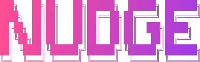
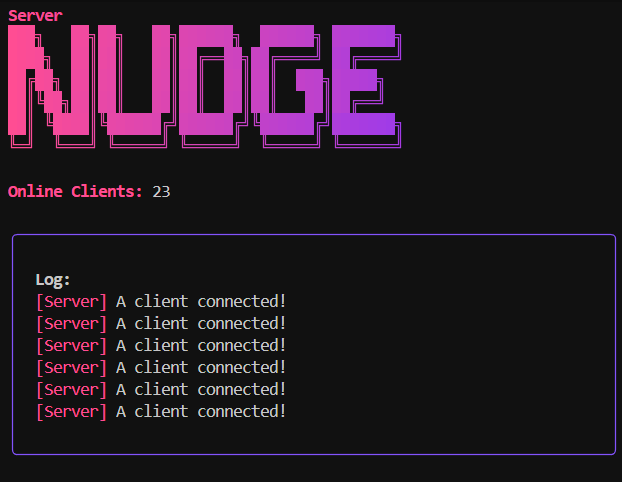
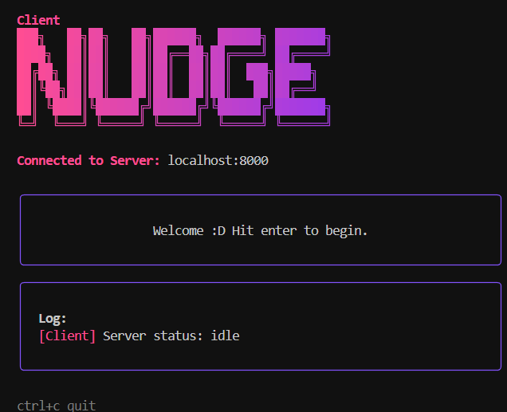
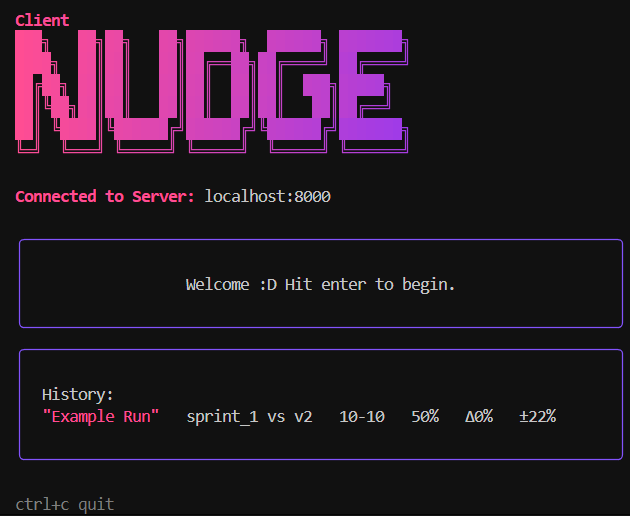

# Nudge


The high performance distributed game runner for battlecode. Nudge helps you test your bots fast with confidence.


## By The Way
If this runner helps you out, give this repo a star. ⭐ It lets me know my work is helping people out.  

# Tutorial
## Prerequisites
First, clone this repository onto your device. Then you'll need to install some dependencies.

Nudge requires three things to run:
1. Java 21
2. Deno
3. Go

Alternatively, we provide a nix flake to automatically handle the dependnecies.

### Java
The steps should be the same for running the battlecode client. If you neeed help here check out battlecode's resources on this topic.
### Deno
You can install deno from [here.](https://deno.com/) You may need to restart your computer.
### Go
You can install go from [here.](https://go.dev/dl/) You may need to restart you computer.

## Adding The Bots
Make sure to copy any bots you want the runner to use into the `example-bots/src/main/` directory. It should look something like this:
```
example-bots
├─ src
│  ├─ main
│  │  ├─ examplefuncsplayer
│  │  ├─ bot_a
│  │  ├─ bot_b
│  │  │ ...
```

When you begin a run, the example-bots directory will be synced to all other clients connected to the server.

## Running Your First Game
First, open a terminal and run the `server.bat` or `server.sh` scripts. This should launch your Nudge server.



Open a second terminal and run the `runner.bat` or `runner.sh` scripts. This should launch a Nudge client. It should look like this:


Enter the address of your server. By default the server runs on port 8000 so simply hitting enter should connect.



Once you see this screen, you're client is ready to run games. Hit `ENTER` and fill in the information. After entering all necessary information the bot code will sync to all clients, and then the run will start. Once the run is done you'll be able to see you're results:



Each history entry displays the run's label, which bots were used, the game record, the first bot's win rate, the win rate difference, and a 95% confidence error bound of the winrate. Usually increasing the amount of games will lower this bound. If you're win rate delta is less than the error bound, then there isn't enough evidence to suggest one bot is better than the other.

## Going Faster / Distributed Running
All clients communicate with the server over websockets without tls. If you want clients on other devices to access your server, they must be able to connect to the server device. We found [tailscale](https://tailscale.com/) works nicely however port forwarding or simply just running all of the clients on a single wifi network should work as well. Simply specify the correct address when connecting other clients, for example `XXX.XX.XX.XX:8000`.

# Help / Feedback
If you need help, reach out over any of these platforms:
- [My Discord](https://discord.gg/z9GKKaJfhJ)
- [Github Issues](https://github.com/outercloudstudio/nudge/issues)
- [Bluesky](https://bsky.app/profile/outercloud.dev)
- [Battlecode Discord](https://discord.gg/ceeej66Z3A)

# License
All additional files are licensed under [MIT](https://raw.githubusercontent.com/outercloudstudio/nudge/refs/heads/master/LICENSE). The battlecode engine and any modifcations to that engine are licensed under the battlecode engine's license.

---

Outer Cloud - For the love of the game